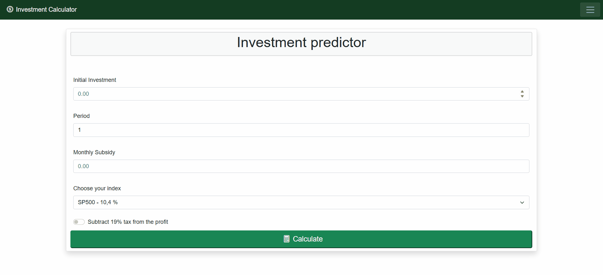

# MJ Invest Calc - Investment Predictor


A professional investment calculator and market analysis platform built using **.NET 8** and **Blazor**. The system combines a high-performance simulation engine with an automated AI data pipeline that delivers daily stock market insights. 

 **Live application:** [mj-invest-calc.azurewebsites.net](https://mj-invest-calc.azurewebsites.net)

 **Status page:** [status-mj-invest](https://7g727976.status.cron-job.org/)
 

> ℹ️ **Hosting Note:** This live demo is deployed on a free Microsoft Azure App Service instance. While free cloud tiers traditionally suffer from idle timeouts and delayed initial requests ("cold starts"), this application implements an automated keep-alive mechanism orchestrated via **Cron-job.org**. By scheduling high-frequency synthetic pings, the runtime container remains persistently warm, ensuring sub-second response times for immediate user access.
---

## 🛠️ Tech Stack
| Layer | Technology |
| :--- | :--- |
| **Frontend / Presentation** | C# .NET 8 (Blazor Web App) |
| **Render Mode** | Interactive Server (Real-time UI updates via SignalR) |
| **UI Framework** | Bootstrap 5 (Responsive / Mobile-First design) |
| **Data Visualization** | ApexCharts.Blazor |
| **ORM & Database** | Entity Framework Core / Azure Database for PostgreSQL (Flexible Server) |
| **AI & External APIs** | Google Gemini API / Alpha Vantage API |
| **Background Processes** | .NET Hosted Services (`IHostedService`) |
| **Containerization** | Docker / Docker Compose |
| **Testing Engine** | xUnit / FluentAssertions |


##  Key Features

The application is logically split into two, decoupled product modules:

### 📊 1. Investment Calculator

*   **Compound Interest Engine:** High-precision future value calculations for long-term equity growth simulation.
*   **Tax Logic Execution:** Automated, real-time application of the 19% capital gains tax (Belka Tax) deducted precisely upon simulation periods.
*   **Dynamic Interactive Charting:** Interactive line charts visualizing asset growth trajectories over time under different financial scenarios. Chart image can be downloaded in SVG, PNG, and CSV formats
*   **Ergonomic UI:** Responsive "Drawer" style navigation built specifically for Mobile and Desktop viewports. 

### 🤖 2. Daily AI News (Market Intelligence Hub)

*   **Automated Aggregation:** A fully asynchronous pipeline pulling financial market updates and stock sentiment data using the Alpha Vantage API.
*   **AI Synthesis & Summarization:** Advanced NLP orchestration powered by the Gemini API, generating smart, context-aware morning market reports.
*   **Decoupled Orchestration:** Background worker executing scheduled cron-like updates independently of client traffic.
*   **Persistent Analytics Cache:** All market snapshots are fully structured and saved via EF Core into an isolated cloud database (PostgreSQL) for instant retrieval speeds.
### ⏱️ Data Aggregation Strategy (08:30 CET/CEST Execution)

The background orchestrator (IHostedService) is scheduled to execute the Alpha Vantage API pipeline daily at exactly **08:30 AM local Polish time**. 

#### 1. Business Logic (Why 08:30?):
This execution window consolidates a global market snapshot just before the European trading session begins:
* **Asia:** Captures confirmed closing metrics from Tokyo and Shanghai.
* **Europe:** Intersects with pre-market analyses (~30 minutes before London/Frankfurt opening bells).
* **USA:** Captures early S&P 500 futures trajectory based on overnight global momentum.

#### 2. Technical Implementation & Resilience:
* **Timezone Handling:** Utilizes TimeZoneInfo to strictly bind execution to Central European Standard Time. This ensures the schedule remains immune to Azure's default UTC host configuration and automatically adjusts for DST (Daylight Saving Time) shifts.
* **API Rate Limit Protection:** To strictly respect Alpha Vantage free-tier limits, the orchestrator queries the PostgreSQL database (AnyAsync) to verify if a daily report already exists before initiating any external HTTP calls.
* **Fault Tolerance:** In case of API timeouts or empty responses, the system catches the exception and defers execution, sleeping for 15-minute intervals until the data is successfully fetched and saved.

## 📁 Project Structure
The project follows **Clean Architecture** principles to ensure scalability.
* **[InvestmentPredictor.Core:](./InvestmentPredictor/InvestmentPredictor.Core)** The core engine containing domain entities (MarketSnippet), financial math formulas and abstract API orchestration infrastructure.
* **[InvestmentPredictor.WebApp:](./InvestmentPredictor/InvestmentCalculator.WebApp)** The primary Blazor frontend, handling UI, routing, SignalR connections, the Entity Framework database context (AppDbContext), and production environment configurations.
* **[InvestmentPredictor.Console (Legacy/Testing):](./InvestmentPredictor/InvestmentPredictor.Console)** The initial version of the project. Currently used as a sandbox for rapid testing of new financial algorithms.
* **[InvestmentPredictor.api (Experimental):](InvestmentPredictor/InvestmentPredictor.api)** A REST API layer designed to potentially serve data to other clients (e.g., mobile apps) in the future.
* **[InvestmentPredictor.Core.Tests:](./InvestmentPredictor/InvestmentPredictor.Core.Tests)** A comprehensive unit testing project securing core financial logic, input validation, and edge-case handling.

## 📊 Calculation Methodology

* **Historical Data Benchmarking:** When selecting a market index (e.g., S&P 500), the system utilizes a 20-year historical average return (where applicable). This provides a smoothed, long-term perspective on market performance, filtering out short-term volatility.
* **Postnumerando Model:** The calculation engine follows the Postnumerando (Ordinary Annuity) convention.
    * Monthly subsidies are added at the end of each period.
    * Interest is compounded on the existing balance before the new monthly contribution is added.
    * This approach provides a more conservative and realistic growth simulation compared to the prenumerando (start-of-period) model.

## ⚙️ Local Setup

### Prerequisites
*   .NET 8 SDK or higher
*   Docker / Docker Desktop (optional, for local infrastructure)
*   Visual Studio 2022 

### Installation Steps
1.  Clone the repository:
    ```bash
    git clone https://github.com/mikolajj04/InvestmentPredictor.git
    cd InvestmentPredictor/InvestmentPredictor
    ```
2.  *(Optional)* Spin up local infrastructure using the included compose manifest:
    ```bash
    docker compose up -d
    ```
3.  Open the solution file `InvestmentPredictor.sln` inside your IDE.
4.  Configure your local secrets or environment variables for the Gemini and Alpha Vantage integrations.
5.  Set `InvestmentCalculator.WebApp` as the startup project and press **F5** to compile and run.


<br>
<br>
<br>

## ⚖️ License & Credits

Distributed under the **MIT License**. See [`LICENSE`](./LICENSE) for more information.


**Author:** **[Mikołaj Jussak](https://github.com/mikolajj04)** – Computer Science Student at Silesian University of Technology.